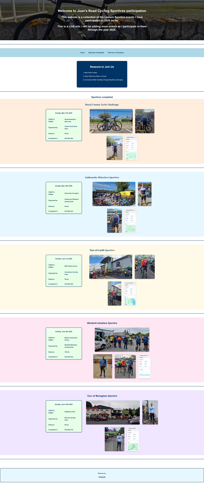

# 1. UX

**Project Overview:** This website showcases Juan's participation in road cycling sportives throughout 2025. It is designed for cycling enthusiasts, potential participants, and anyone interested in exploring leisure cycling events in Ireland. The site provides event details, completion times, and visual documentation of each sportive, offering both inspiration and practical information for those looking to join similar cycling events.

- The website welcomes users with a visually appealing header and a clear introduction to the purpose of the site: showcasing completed road cycling sportives.

- Navigation is simple and intuitive, with a fixed navigation bar at the top providing quick links to the Home section, the list of completed sportives, and the area with a click button to the Author's Facebook profile.

- The "Reasons to join us" section is prominently displayed, encouraging engagement and community participation.

- Each sportive is presented in a consistent, card-like section with a bold title, event details table, and a row of high-quality images, making it easy for users to browse and compare events.

- The use of alternating background colors for each sportive section helps users visually distinguish between different events.

- Responsive design ensures the site is fully usable and attractive on all devices, with tables, images, and text adapting smoothly to different screen sizes.

- Horizontal rules and spacing provide clear separation between sections, improving readability and reducing visual clutter.

- The footer offers a clear call to action for social engagement, with a direct link to the website creator's Facebook profile.

- All text is styled for clarity and accessibility, using high-contrast colors and readable fonts.

- The overall layout guides the user naturally from the introduction, through the reasons to join, to the list of events, and finally to the contact information, creating a logical and user-friendly flow.

### Website Preview



# 2. HTML Structure Overview

The `index.html` file is the main page of the Road Cycling Sportives website. It is organized to provide a clear, responsive, and visually appealing presentation of cycling events. Here is an overview of its structure:

- **DOCTYPE and Head**: The file begins with the HTML5 doctype and includes meta tags for character set, viewport, description, keywords, and author. The page links to the main stylesheet (`assets/css/style.css`) and sets the page title.

- **Body and Main Content**: All visible content is wrapped in a `<div class="main-content">` to control horizontal alignment and spacing.

- **Header**: The `<header class="page-header">` contains the main site title and introductory text, styled with a background image and centered text.

- **Navigation**: The `<nav class="nav">` provides links to the home section, the list of completed sportives, and the footer section where there is a link to Juan's Facebook profile.

- **Reasons Section**: A visually distinct box (`.reasons-box`) highlights reasons to join the cycling group, using an ordered list for clarity.

- **Sportives Section**: The main content area (`<section id="sportives">`) lists all completed sportives. Each sportive is represented by a `.sportive` div containing:

  - An event title (`<h3>`)

  - A flex container (`.sportive-content`) with:

    - A details table (`.sportive-table`) listing date, location, organizer, distance, and completion time

    - A row of event images (`.sportive-images`)

  - Each sportive is separated by a horizontal rule for visual clarity.

- **Footer**: The `<footer class="site-footer">` appears at the bottom, providing a contact link (Facebook) and styled to match the site's color scheme.

- **Responsiveness**: The structure is designed to be fully responsive, with media queries in the CSS ensuring usability and readability on all devices.

---

# 3. CSS Class Reference

This project showcases a responsive website for road cycling sportives, styled with custom CSS. Below is a summary of the purpose and content of each main CSS class used in the project:

### Layout and Structure

- **.main-content**: Wrapper for all main content, used to control horizontal alignment and spacing.

- **.page-header**: Styles the header section with a background image, centering, and vertical alignment.

- **.nav**: Styles the navigation bar, including background color, font, and alignment.

- **.text-center**: Utility class to center text horizontally.

- **.text-white**: Utility class to set text color to white.

- **.text-uppercase**: Utility class to transform text to uppercase.

- **.one-third-width-column**: Restricts content width to one third of the page and centers it.

### Content Sections

- **.reasons-box**: Styles the "Reasons to join us" box with a dark blue background, rounded corners, padding, and shadow.

- **.sportive**: Main container for each sportive section. Applies unique background color, full-width layout, and spacing.

- **.sportive-content**: Flex container for the table and images within each sportive, with horizontal gap and left padding for alignment.

- **.sportive-table**: Styles the event details table with a light green background, thick dark blue border, rounded corners, and bold Arial text. Only the outer border is visible.

- **.sportive-images**: Flex container for event images, aligning them in a row with spacing and consistent height.

### Typography

- **h1, h2, h3**: Header tags styled for font, color, and size. `.sportive h3` is further enlarged and italicized for event titles.

- **.site-footer**: Styles the footer with a light blue background, dark blue text, bold Arial font, and centered alignment. Footer links are styled to match the site's color scheme.

### Table Details

- **.sportive-table td, .sportive-table th**: Ensures all table text is bold, dark blue, and uses Arial font.

- **.sportive-table tr:first-child td**: Special style for the first row (date), making it italic, centered, and slightly larger.

### Responsive Design

- Media queries adjust layout, font size, image size, and padding for tablets and mobile devices to ensure the site remains visually appealing and usable on all screen sizes.

---

# 4. Credits

This project was completed following the tutorials and classes from the HTML and CSS sections of the Code Institute course. The foundational knowledge and best practices taught in these modules were applied throughout the development of this website.

---

# 5. Testing

### HTML Validator

I have validated the HTML code and ensured it meets web standards:

1. I went to the [W3C HTML Validator](https://validator.w3.org/).

2. Click on the "Validate by File Upload" tab.

3. Click "Choose File" and select `index.html` file from the project directory.

4. Click the "Check" button.

5. Review the results for any errors or warnings. The validator highlights issues and suggest corrections. 

*6. After following these steps, the result was: Congratulations! No Error Found.*

### CSS Validator

I have validated the CSS code and ensured it is error-free:

1. I went to the [W3C CSS Validator](https://jigsaw.w3.org/css-validator/).

2. Click on the "By File Upload" tab.

3. Click "Choose File" and select `style.css` file from the `assets/css` directory.

4. Click the "Check" button.

5. Review the results for any errors or warnings. The validator highlights issues and suggest corrections. 

*6. After following these steps, the result was: Congratulations! No Error Found.*

---

*By following these steps, I can ensure my website's HTML and CSS are valid, accessible, and compatible with modern browsers.*

# 6. Deployment

### Syncing the project to GitHub

I have added and synced my `03_PROJECT1` to GitHub from within VS Code, I followed these steps:

1. Open VS Code in the `03_PROJECT1` folder.

2. Open the terminal in VS Code (`Ctrl+``) and initialize a Git repository:
   ```
   git init
   ```

3. Add all files to the repository and make the first commit:
   ```
   git add .
   git commit -m "Initial commit"
   ```

4. Go to [GitHub](https://github.com) and create a new repository (`code_institute_milestone_1`). Do not initialize with a README, as I already have one.

5. Copy the repository URL provided by GitHub (e.g., `https://github.com/Juanakas/code_institute_milestone_1.git`)

6. In the VS Code terminal, connect the local repository to GitHub:
   ```
   git remote add origin https://github.com/yourusername/03_PROJECT1.git
   ```

7. Set the main branch and push your code to GitHub:
   ```
   git branch -M main
   git push -u origin main
   ```

*The project is now published on GitHub. I can use the Source Control panel in VS Code for future commits and pushes.*

### Deploying to GitHub Pages

To deploy my website to GitHub Pages:

- I made sure the main HTML file is named `index.html`.
- I pushed all the latest changes to GitHub.
- I went to the repository on GitHub in the web browser.
- I Clicked the "Settings" tab at the top of the repository page.
- In the left sidebar, scrolled down and clicked "Pages" (or "Pages and deployment").
- Under "Branch", selected `main` (or `master` if that's your branch), and set the folder to `/ (root)`.
- Clicked "Save".
- GitHub will build the site. After a minute or two, I got a link to the live site. Visit that link to view the deployed website.

<span style="font-size: 105%; font-weight: bold;"><strong><em>My Code Institute Milestone_1 Project in Github Pages: <a href="https://juanakas.github.io/code_institute_milestone_1/#home">https://juanakas.github.io/code_institute_milestone_1/#home</a></em></strong></span>

My site is now live and accessible to anyone with the link!

Thank you for visiting.
